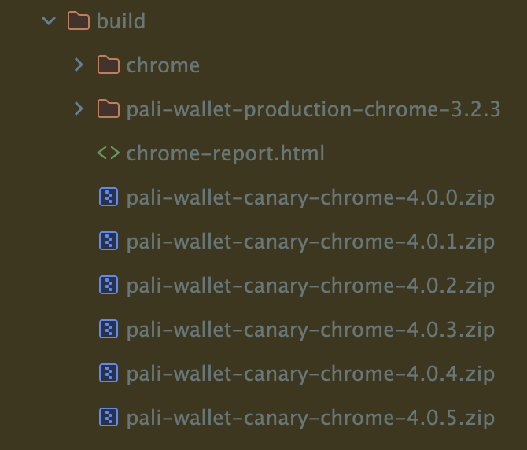

# Comprehensive Documentation: Sysweb3 & Pali Wallet

## Table of Contents

1. [Overview](#overview)
2. [Sysweb3 Library](#sysweb3-library)
    - [Architecture](#sysweb3-architecture)
    - [Packages](#sysweb3-packages)
    - [Build System](#build-system)
    - [Configuration](#configuration)
3. [Pali Wallet](#pali-wallet)
    - [Architecture](#pali-wallet-architecture)
    - [State Management](#state-management)
    - [Controllers](#controllers)
    - [Build System](#pali-wallet-build-system)
4. [Integration: Sysweb3 & Pali Wallet](#integration-sysweb3--pali-wallet)
    - [Communication Flow](#communication-flow)
    - [Dependency Graph](#dependency-graph)
    - [Data Flow](#data-flow)
5. [Trade-offs and Design Decisions](#trade-offs-and-design-decisions)
6. [Configuration Reference](#configuration-reference)
7. [Testing](#testing)
8. [Security Considerations](#security-considerations)

---

## Overview

This documentation covers two interconnected repositories:

1. **Sysweb3** (`sysweb3`) - A JavaScript/TypeScript library providing blockchain interaction utilities for Syscoin
   multi-chain development
2. **Pali Wallet** (`pali-wallet`) - A browser extension wallet that uses Sysweb3 as its core blockchain interaction
   layer

### High-Level Architecture

```
┌─────────────────────────────────────────────────────────────────────────┐
│                           PALI WALLET                                   │
│  ┌─────────────┐  ┌──────────────┐  ┌────────────────┐                  │
│  │  React UI   │──│ Redux Store  │──│ Background     │                  │
│  │  (Popup)    │  │ (State)      │  │ Service Worker │                  │
│  └─────────────┘  └──────────────┘  └────────┬───────┘                  │
│                                              │                          │
│                         ┌────────────────────┴────────────────────┐     │
│                         │         MainController                  │     │
│                         │  (Orchestrates all operations)          │     │
│                         └────────────────────┬────────────────────┘     │
└──────────────────────────────────────────────┼──────────────────────────┘
                                               │
                    ┌──────────────────────────┼──────────────────────────┐
                    │                    SYSWEB3                          │
                    │  ┌──────────────┐  ┌────────────────┐               │
                    │  │ sysweb3-core │  │sysweb3-network │               │
                    │  │  (Storage)   │  │  (RPC/Networks)│               │
                    │  └──────────────┘  └────────────────┘               │
                    │  ┌────────────────┐   ┌────────────────┐            │
                    │  │sysweb3-keyring │   │ sysweb3-utils  │            │
                    │  │(Wallet/Signing)│   │(Contracts/Addr)│            │
                    │  └────────────────┘   └────────────────┘            │
                    └─────────────────────────────────────────────────────┘
```

---

## Sysweb3 Library

### Sysweb3 Architecture

Sysweb3 is a **monorepo** using Yarn Workspaces, containing four specialized packages:

| Package                     | Version | Purpose                      |
|-----------------------------|---------|------------------------------|
| `@sidhujag/sysweb3-core`    | 1.0.27  | Storage abstraction layer    |
| `@sidhujag/sysweb3-network` | 1.0.106 | Network management & RPC     |
| `@sidhujag/sysweb3-utils`   | 1.1.271 | Contract & address utilities |
| `@sidhujag/sysweb3-keyring` | 1.0.565 | Wallet & transaction signing |

### Package Dependency Graph

```
┌─────────────────────────────────────────────────────────────────┐
│                      sysweb3-keyring                            │
│  (Wallet management, signing, hardware wallets)                 │
├─────────────────────────────────────────────────────────────────┤
│     ▲                    ▲                    ▲                 │
│     │                    │                    │                 │
├─────┴──────────┬─────────┴──────────┬────────┴──────────────────┤
│  sysweb3-core  │  sysweb3-network   │   sysweb3-utils           │
│  (Storage)     │  (RPC/Networks)    │   (Contracts)             │
├────────────────┴────────────────────┴───────────────────────────┤
│                    External Dependencies                        │
│  syscoinjs-lib, ethers.js, @ledgerhq/*, @trezor/*               │
└─────────────────────────────────────────────────────────────────┘
```

---

### Sysweb3 Packages

#### 1. sysweb3-core

**Location**: `/packages/sysweb3-core`
**Purpose**: Browser interaction functions for state storage management

##### Exports

```typescript
// Main exports from sysweb3-core
export { StateStorageDb } from './utils';
export { MemoryStorageClient } from './utils';
export { CrossPlatformDi, sysweb3Di } from './di';
export type { IKeyValueDb, IStateStorageClient } from './utils';
```

##### Interfaces

```typescript
interface IStateStorageClient {
  getItem(key: string): string | null;

  removeItem(key: string): void;

  setItem(key: string, value: string): void;
}

interface IKeyValueDb {
  deleteItem(key: string): void;

  get(key: string): Promise<any>;

  set(key: string, value: any): Promise<void>;

  setClient(client?: IStateStorageClient): void;

  setPrefix(prefix: string): void;
}
```

##### Usage Pattern

```typescript
import { sysweb3Di } from '@sidhujag/sysweb3-core';

// Get storage instance
const storage = sysweb3Di.getStateStorageDb();

// Set custom storage client (e.g., chrome.storage)
storage.setClient(customClient);

// Store/retrieve data
await storage.set('key', { data: 'value' });
const data = await storage.get('key');
```

##### Trade-offs

| Decision               | Rationale                                                             |
|------------------------|-----------------------------------------------------------------------|
| Abstracted storage     | Allows swapping between localStorage, chrome.storage, memory          |
| Singleton DI container | Ensures consistent state across the application                       |
| Async API              | Supports both sync (localStorage) and async (chrome.storage) backends |

---

#### 2. sysweb3-network

**Location**: `/packages/sysweb3-network`
**Purpose**: Network management, RPC validation, and blockchain link management

##### Exports

```typescript
// Network types and interfaces
export { INetwork, INetworkType } from './types';

// RPC utilities
export {
  getSysRpc,
  getEthRpc,
  validateRpcBatchUniversal,
  retryableFetch,
  clearRpcCaches,
  getNetworkConfig,
} from './rpc';

// Network configurations
export { getNetworkConfigFromCoin, ALL_EVM_NETWORKS_DATA } from './networks';

// Coin definitions
export { coins } from './coins';

// Validation
export { validateCurrentRpcUrl, validateChainId } from './validation';
```

##### Key Types

```typescript
export enum INetworkType {
  Ethereum = 'ethereum',
  Syscoin = 'syscoin',
}

export interface INetwork {
  apiUrl?: string;
  chainId: number;
  coingeckoId?: string;
  coingeckoPlatformId?: string;
  currency: string;
  default?: boolean;
  explorer?: string;
  key?: string;
  kind: INetworkType;
  label: string;
  slip44: number;
  url: string;
}
```

##### RPC Validation with Caching

```typescript
// RPC validation caches results for 5 minutes
const rpcCacheMap = new Map<string, { result: boolean; timestamp: number }>();
const RPC_CACHE_TTL = 5 * 60 * 1000; // 5 minutes

export async function validateCurrentRpcUrl(
  url: string,
  chainId?: number
): Promise<boolean> {
  const cached = rpcCacheMap.get(url);
  if (cached && Date.now() - cached.timestamp < RPC_CACHE_TTL) {
    return cached.result;
  }
  // ... validation logic
}
```

##### Supported Networks

**EVM Networks:**

- Ethereum Mainnet (chainId: 1, slip44: 60)
- Polygon (chainId: 137, slip44: 60)
- Syscoin NEVM (chainId: 57, slip44: 60)
- Rollux (chainId: 570, slip44: 60)
- zkSync Era (chainId: 324, slip44: 60)

**UTXO Networks:**

- Bitcoin Mainnet (slip44: 0)
- Bitcoin Testnet (slip44: 1)
- Syscoin Mainnet (slip44: 57)

##### Trade-offs

| Decision                             | Rationale                                               |
|--------------------------------------|---------------------------------------------------------|
| 5-minute RPC cache                   | Balance between freshness and performance               |
| Retry logic with exponential backoff | Handle unreliable RPC endpoints                         |
| Separate EVM vs UTXO network types   | Different transaction models require different handling |
| Blockbook integration                | Required for UTXO address/balance queries               |

---

#### 3. sysweb3-utils

**Location**: `/packages/sysweb3-utils`
**Purpose**: Helper library for contract interactions, address validation, and token utilities

##### Exports

```typescript
// Address validation
export {
  isValidEthereumAddress,
  isValidSYSAddress,
  validateEOAAddress,
} from './address';

// Contract utilities
export {
  createContractUsingAbi,
  contractChecker,
  isContractAddress,
  getContractType,
} from './contracts';

// Token utilities
export {
  validateToken,
  getTokenStandardMetadata,
  getNftStandardMetadata,
  cleanTokenSymbol,
  getAsset,
  getFiatValueByToken,
} from './tokens';

// Transaction utilities
export { txUtils, ITxid } from './transactions';

// Encryption
export { encryptor } from './encryptor';

// Constants
export { MAX_SAFE_CHAIN_ID } from './constants';

// ABI exports
export { getErc20Abi, getErc21Abi, getErc55Abi } from './abi';
```

##### Address Validation

```typescript
// Ethereum address validation (with checksum)
export const isValidEthereumAddress = (address: string): boolean => {
  if (!address || typeof address !== 'string') return false;
  if (!/^0x[a-fA-F0-9]{40}$/.test(address)) return false;
  // EIP-55 checksum validation
  return getAddress(address) === address;
};

// Syscoin bech32 address validation
export const isValidSYSAddress = (
  address: string,
  network?: 'mainnet' | 'testnet'
): boolean => {
  try {
    const decoded = bech32.decode(address);
    const expectedPrefix = network === 'testnet' ? 'tsys' : 'sys';
    return decoded.prefix === expectedPrefix;
  } catch {
    return false;
  }
};

// EOA vs Contract detection
export const validateEOAAddress = async (
  address: string,
  provider: JsonRpcProvider
): Promise<boolean> => {
  const code = await provider.getCode(address);
  return code === '0x'; // EOA has no code
};
```

##### Contract Type Detection

```typescript
export const getContractType = async (
  contractAddress: string,
  web3Provider: any
): Promise<ISupportsInterfaceProps | undefined> => {
  // Try ERC-721 (0x80ac58cd)
  // Try ERC-1155 (0xd9b67a26)
  // Try ERC-20 (balanceOf check)
  // Return 'Unknown' if none match
};

export interface ISupportsInterfaceProps {
  message?: string;
  type: 'ERC-20' | 'ERC-721' | 'ERC-1155' | 'Unknown';
}
```

##### Token Symbol Cleaning

```typescript
// Remove spam from token symbols
export const cleanTokenSymbol = (symbol: string): string => {
  if (!symbol) return symbol;

  // Find first occurrence of spam separators
  const separatorMatch = symbol.match(/[:\s|/\\()[\]{}<>=+&%#@!?;~`"'-]/);
  if (separatorMatch) {
    const cleanSymbol = symbol.substring(0, separatorMatch.index).trim();
    return cleanSymbol.length > 0 ? cleanSymbol : symbol;
  }

  return symbol;
};
```

##### Trade-offs

| Decision                   | Rationale                              |
|----------------------------|----------------------------------------|
| EIP-55 checksum validation | Prevents address typos and phishing    |
| supportsInterface fallback | Some contracts don't implement ERC-165 |
| Symbol cleaning            | Combat token spam attacks              |
| IPFS URL normalization     | Handle various IPFS gateway formats    |

---

#### 4. sysweb3-keyring

**Location**: `/packages/sysweb3-keyring`
**Purpose**: Keyring Manager for UTXO and Web3 Wallets with hardware wallet support

##### Exports

```typescript
// Core keyring
export { KeyringManager, ISysAccount } from './keyring-manager';

// Types
export {
  IKeyringManager,
  IEthereumTransactions,
  ISyscoinTransactions,
  IKeyringAccountState,
  KeyringAccountType,
  SimpleTransactionRequest,
} from './types';

// Transaction handlers
export { EthereumTransactions } from './transactions/ethereum';
export { SyscoinTransactions } from './transactions/syscoin';

// Hardware wallets
export { LedgerKeyring } from './ledger';
export { TrezorKeyring } from './trezor';
export { HardwareWalletManager } from './hardware-wallet-manager';
export { HardwareWalletManagerSingleton } from './hardware-wallet-manager-singleton';

// Storage
export { getDecryptedVault, setEncryptedVault } from './storage';

// Providers
export { CustomJsonRpcProvider } from './providers';

// Utilities
export { PsbtUtils } from './utils/psbt';
export { getAddressDerivationPath, isEvmCoin } from './utils/derivation-paths';
```

##### KeyringManager Class

```typescript
export class KeyringManager implements IKeyringManager {
  public trezorSigner: TrezorKeyring;
  public ledgerSigner: LedgerKeyring;
  public ethereumTransaction: IEthereumTransactions;
  public syscoinTransaction: ISyscoinTransactions;

  // Secure session management
  private sessionPassword: SecureBuffer | null = null;
  private sessionMnemonic: SecureBuffer | null = null;

  // Vault state getter (injected from Pali)
  private getVaultState: (() => any) | null = null;

  constructor(sharedHardwareWalletManager?: HardwareWalletManager) {
    // Initialize hardware wallet signers
    // Initialize transaction handlers
    // Set up storage
  }

  // Core methods
  public async initializeWalletSecurely(
    seedPhrase: string,
    password: string
  ): Promise<IKeyringAccountState>;

  public async unlock(password: string): Promise<{
    canLogin: boolean;
    needsAccountCreation?: boolean;
  }>;

  public async addNewAccount(label?: string): Promise<IKeyringAccountState>;

  public async setSignerNetwork(network: INetwork): Promise<{
    success: boolean;
  }>;

  // Hardware wallet methods
  public async importLedgerAccount(label?: string): Promise<IKeyringAccountState>;

  public async importTrezorAccount(label?: string): Promise<IKeyringAccountState>;
}
```

##### Account Types

```typescript
export enum KeyringAccountType {
  HDAccount = 'HDAccount',   // Standard HD wallet accounts
  Imported = 'Imported',     // Private key imports
  Ledger = 'Ledger',         // Ledger hardware wallet
  Trezor = 'Trezor',         // Trezor hardware wallet
}

export interface IKeyringAccountState {
  address: string;
  balances: {
    ethereum: number;
    syscoin: number;
  };
  id: number;
  isImported: boolean;
  isLedgerWallet: boolean;
  isTrezorWallet: boolean;
  label: string;
  xprv: string;  // Encrypted extended private key
  xpub: string;  // Extended public key
}
```

##### Transaction Interfaces

```typescript
export interface IEthereumTransactions {
  // Sending transactions
  sendFormattedTransaction(
    params: SimpleTransactionRequest,
    isLegacy?: boolean
  ): Promise<TransactionResponse>;

  sendSignedErc20Transaction(params: { ... }): Promise<IResponseFromSendErcSignedTransaction>;

  sendSignedErc721Transaction(params: { ... }): Promise<IResponseFromSendErcSignedTransaction>;

  sendSignedErc1155Transaction(params: { ... }): Promise<IResponseFromSendErcSignedTransaction>;

  // Signing
  signPersonalMessage(params: string[]): Promise<string>;

  signTypedData(
    addr: string,
    typedData: TypedDataV1 | TypedMessage<any>,
    version: SignTypedDataVersion
  ): Promise<string>;

  ethSign(params: string[]): Promise<string>;

  // Fee estimation
  getFeeByType(type: string): Promise<string>;

  getGasLimit(toAddress: string): Promise<number>;

  getTxGasLimit(tx: SimpleTransactionRequest): Promise<BigNumber>;

  getFeeDataWithDynamicMaxPriorityFeePerGas(): Promise<any>;

  // Transaction management
  cancelSentTransaction(txHash: string, isLegacy?: boolean): Promise<{ ... }>;

  sendTransactionWithEditedFee(txHash: string, isLegacy?: boolean): Promise<{ ... }>;
}

export interface ISyscoinTransactions {
  getEstimateSysTransactionFee(params: {
    amount: number;
    receivingAddress: string;
    feeRate?: number;
    token?: { guid: string; symbol?: string } | null;
    isMax?: boolean;
  }): Promise<{ fee: number; psbt: any }>;

  signPSBT(params: {
    psbt: any;
    isTrezor?: boolean;
    isLedger?: boolean;
  }): Promise<any>;

  sendTransaction(psbt: any): Promise<ITxid>;

  getRecommendedFee(explorerUrl: string): Promise<number>;

  decodeRawTransaction(psbtOrHex: any, isRawHex?: boolean): any;
}
```

##### Secure Buffer Implementation

```typescript
class SecureBuffer {
  private buffer: Buffer | null;
  private _isCleared = false;

  constructor(data: string | Buffer) {
    this.buffer = Buffer.from(data);
  }

  get(): Buffer {
    if (this._isCleared) throw new Error('SecureBuffer has been cleared');
    return Buffer.from(this.buffer!);
  }

  clear(): void {
    if (!this._isCleared && this.buffer) {
      // Overwrite with random data first
      crypto.randomFillSync(this.buffer);
      // Then fill with zeros
      this.buffer.fill(0);
      this.buffer = null;
      this._isCleared = true;
    }
  }
}
```

##### Hardware Wallet Manager

```typescript
export class HardwareWalletManager {
  private static DEBOUNCE_MS = 200;

  // Connection pooling for hardware wallets
  public async withLedgerConnection<T>(
    operation: (transport: Transport) => Promise<T>,
    devicePath?: string
  ): Promise<T>;

  public async getLedgerDevices(): Promise<HIDDevice[]>;

  // Singleton pattern for shared connections
  public static getInstance(): HardwareWalletManager;
}
```

##### Trade-offs

| Decision                            | Rationale                                           |
|-------------------------------------|-----------------------------------------------------|
| SecureBuffer with explicit clearing | Memory-safe handling of sensitive data              |
| Session-based unlock                | Balance between security and UX                     |
| Multi-keyring per slip44            | Different UTXO chains need separate derivation      |
| Singleton hardware wallet manager   | Prevent "device already open" errors                |
| PSBT for UTXO signing               | Industry standard for hardware wallet compatibility |
| Vault state getter injection        | Decouple keyring from Redux store                   |

---

### Build System

#### TypeScript Configuration

**Root tsconfig-package.json:**

```json
{
  "compilerOptions": {
    "target": "es2020",
    "module": "CommonJS",
    "lib": [
      "es2020",
      "dom"
    ],
    "strict": true,
    "declaration": true,
    "declarationMap": true,
    "sourceMap": true,
    "moduleResolution": "node",
    "esModuleInterop": true,
    "skipLibCheck": true,
    "forceConsistentCasingInFileNames": true
  }
}
```

**Output Structure:**

```
packages/sysweb3-*/
├── src/           # Source TypeScript
└── dist/
    ├── cjs/       # CommonJS output
    └── types/     # Type declarations
```

#### Build Commands

```bash
# Per-package builds
cd packages/sysweb3-keyring
yarn prebuild    # rm -rf dist
yarn build       # tsc (CJS) && tsc (types)

# Root builds
yarn build:all   # Build all packages
yarn publish:all # Publish to npm
```

---

### Configuration

#### Package.json Scripts

```json
{
  "scripts": {
    "prebuild": "rm -rf dist",
    "build": "tsc --project tsconfig.build.json --outDir dist/cjs && tsc --project tsconfig.types.json --outDir dist/types --emitDeclarationOnly",
    "release:npm": "npm publish --access public",
    "localTest": "yarn build && yarn copy",
    "publishCode": "yarn build && yarn copy && npm publish"
  }
}
```

#### ESLint Configuration

```json
{
  "parser": "@typescript-eslint/parser",
  "extends": [
    "eslint:recommended",
    "plugin:@typescript-eslint/recommended",
    "prettier",
    "plugin:import/recommended"
  ],
  "rules": {
    "import/order": [
      "warn",
      {
        "groups": [
          "builtin",
          "external",
          "internal",
          "parent",
          "sibling"
        ],
        "alphabetize": {
          "order": "asc"
        }
      }
    ]
  }
}
```

---

## Pali Wallet

### Pali Wallet Architecture

Pali Wallet is a **browser extension** (Manifest V3) supporting Chrome, Firefox, and Opera.

#### Project Structure

```
pali-wallet/
├── source/
│   ├── assets/           # Images, icons
│   ├── components/       # React UI components
│   ├── config/           # Webpack configs
│   ├── constants/        # App constants
│   ├── hooks/            # React hooks
│   ├── pages/            # Page components
│   ├── routers/          # React Router setup
│   ├── scripts/
│   │   ├── Background/   # Service worker
│   │   │   ├── controllers/
│   │   │   │   ├── MainController.ts
│   │   │   │   ├── DAppController.ts
│   │   │   │   ├── assets/
│   │   │   │   ├── balances/
│   │   │   │   ├── transactions/
│   │   │   │   └── message-handler/
│   │   │   └── handlers/
│   │   ├── ContentScript/  # Injected scripts
│   │   └── Provider/       # Web3 provider
│   ├── state/            # Redux store
│   │   ├── vault/        # Per-slip44 state
│   │   ├── vaultGlobal/  # Global state
│   │   ├── dapp/         # DApp connections
│   │   └── price/        # Price data
│   ├── types/            # TypeScript types
│   └── utils/            # Utility functions
├── views/                # HTML templates
├── tests/                # Test suites
├── manifest.json         # Extension manifest
├── package.json
├── tsconfig.json
└── webpack configs
```

#### Manifest V3 Structure

```json
{
  "manifest_version": 3,
  "name": "Pali Wallet",
  "version": "4.0.8",
  "permissions": [
    "hid",
    // Hardware wallets
    "alarms",
    // Auto-lock timer
    "storage",
    // State persistence
    "activeTab",
    // Tab access
    "clipboardWrite",
    "unlimitedStorage",
    "offscreen",
    // Offscreen document for HW
    "scripting",
    "notifications"
  ],
  "background": {
    "service_worker": "js/background.bundle.js"
  },
  "content_scripts": [
    {
      "matches": [
        "<all_urls>"
      ],
      "js": [
        "js/contentScript.bundle.js"
      ],
      "run_at": "document_start"
    }
  ]
}
```

---

### State Management

Pali uses **Redux Toolkit** with a slip44-based vault architecture:

```typescript
// store.ts
const reducers = combineReducers({
  dapp,        // DApp connection state
  price,       // Fiat prices
  vault,       // Per-slip44 state (active)
  vaultGlobal, // Global state
  spamFilter,  // Spam detection
});
```

#### State Architecture

```
┌─────────────────────────────────────────────────────────────────┐
│                      REDUX STORE                                │
├─────────────────────────────────────────────────────────────────┤
│  vaultGlobal (Global - Shared across all networks)              │
│  ├── activeSlip44: number                                       │
│  ├── networks: { ethereum: {...}, syscoin: {...} }              │
│  ├── advancedSettings: { refresh: boolean, ledger: boolean }    │
│  ├── hasEncryptedVault: boolean                                 │
│  ├── lastLogin: number                                          │
│  ├── networkStatus: 'idle' | 'switching' | 'error'              │
│  └── loadingStates: { isLoadingBalances: boolean }              │
├─────────────────────────────────────────────────────────────────┤
│  vault (Per-Slip44 - Stored separately per network type)        │
│  ├── accounts: { HDAccount: {...}, Imported: {...}, ... }       │
│  ├── activeAccount: { id: number, type: KeyringAccountType }    │
│  ├── activeNetwork: INetwork                                    │
│  ├── activeChain: INetworkType                                  │
│  ├── accountAssets: { [type]: { [id]: IAccountAssets } }        │
│  └── accountTransactions: { [type]: { [id]: IAccountTransactions } } │
├─────────────────────────────────────────────────────────────────┤
│  dapp (DApp Connection State)                                   │
│  └── connectedAccounts: { [origin]: address[] }                 │
├─────────────────────────────────────────────────────────────────┤
│  price (Fiat Price Data)                                        │
│  └── prices: { syscoin: {...}, ethereum: {...} }                │
└─────────────────────────────────────────────────────────────────┘
```

#### Vault State Types

```typescript
// Per-slip44 state
export interface IVaultState {
  accounts: {
    [key in KeyringAccountType]: { [id: number]: IKeyringAccountState };
  };

  activeAccount: {
    id: number;
    type: KeyringAccountType;
  };

  activeChain: INetworkType;
  activeNetwork: INetwork;
  isBitcoinBased: boolean;

  accountAssets: {
    [key in KeyringAccountType]: { [id: number]: IAccountAssets };
  };

  accountTransactions: {
    [key in KeyringAccountType]: { [id: number]: IAccountTransactions };
  };

  shouldShowFaucetModal: { [chainId: number]: boolean };
}

// Global state
export interface IGlobalState {
  activeSlip44: number | null;
  networks: INetworksVault;
  advancedSettings: { [k: string]: boolean | number };
  hasEncryptedVault: boolean;
  lastLogin: number;
  networkStatus: 'idle' | 'switching' | 'error' | 'connecting';
  isPollingUpdate: boolean;
  loadingStates: ILoadingStates;
  error: string | null;
}
```

#### Vault Caching System

```typescript
// vaultCache.ts - Manages per-slip44 vault storage
class VaultCache {
  private memoryCache = new Map<number, IVaultState>();

  async getSlip44Vault(slip44: number): Promise<IVaultState | null> {
    // Check memory cache first
    if (this.memoryCache.has(slip44)) {
      return this.memoryCache.get(slip44)!;
    }

    // Load from chrome.storage
    const stored = await loadSlip44State(slip44);
    if (stored) {
      this.memoryCache.set(slip44, stored);
    }
    return stored;
  }

  async saveSlip44Vault(slip44: number, state: IVaultState): Promise<void> {
    this.memoryCache.set(slip44, state);
    await saveSlip44State(slip44, state);
  }
}
```

---

### Controllers

#### MasterController

The main orchestrator that ties everything together:

```typescript
// controllers/index.ts
export interface IMasterController {
  appRoute: (newRoute?: string, external?: boolean) => string;
  callGetLatestUpdateForAccount: (isPolling?: boolean) => Promise<boolean>;
  createPopup: (route?: string, data?: object) => Promise<chrome.windows.Window>;
  dapp: Readonly<IDAppController>;
  wallet: MainController;
  refresh: () => void;
  rehydrate: () => void;
}

const MasterController = (store: Store): IMasterController => {
  let wallet: MainController;
  let dapp: Readonly<IDAppController>;

  const initializeMainController = () => {
    // Initialize networks in vaultGlobal
    // Set up DApp controller
    // Create MainController
    dapp = Object.freeze(DAppController());
    wallet = new MainController();
  };

  return {
    wallet,
    dapp,
    appRoute,
    createPopup,
    refresh,
    rehydrate,
    callGetLatestUpdateForAccount,
  };
};
```

#### MainController

The core wallet controller:

```typescript
// controllers/MainController.ts
class MainController {
  // Multi-keyring architecture (one per slip44)
  private keyrings: Map<number, KeyringManager> = new Map();

  // Sub-controllers
  public account: {
    eth: IEthAccountController;
    sys: ISysAccountController;
  };
  public assets: IAssetsManager;
  public transactions: ITransactionsManager;
  private balancesManager: IBalancesManager;

  // State management
  private cancellablePromises: CancellablePromises;
  private persistentProviders = new Map<string, CustomJsonRpcProvider>();

  // Auto-lock
  private autoLockAlarmName = 'pali_auto_lock_timer';

  // Key methods
  async createWallet(password: string): Promise<IKeyringAccountState>;

  async unlock(password: string): Promise<boolean>;

  async lock(): Promise<void>;

  async switchNetwork(network: INetwork): Promise<void>;

  async switchAccount(id: number, type: KeyringAccountType): Promise<void>;

  async getLatestUpdateForCurrentAccount(isPolling?: boolean): Promise<boolean>;
}
```

#### DAppController

Handles web3 provider requests from dApps:

```typescript
// controllers/DAppController.ts
export interface IDAppController {
  // Connection management
  connect(origin: string): Promise<string[]>;

  disconnect(origin: string): void;

  isConnected(origin: string): boolean;

  // Request handling
  handleRequest(
    origin: string,
    method: string,
    params: any[]
  ): Promise<any>;
}
```

#### Message Handler Pipeline

```typescript
// controllers/message-handler/request-pipeline.ts
export async function handleDAppRequest(
  origin: string,
  method: string,
  params: any[],
  tabId: number
): Promise<any> {
  // 1. Validate origin and method
  // 2. Apply middleware (spam filter, typed data validation)
  // 3. Route to appropriate handler
  // 4. Return result or error
}

// Supported methods
const methodHandlers = {
  // Connection
  'eth_requestAccounts': handleRequestAccounts,
  'wallet_requestPermissions': handleRequestPermissions,

  // Chain
  'eth_chainId': handleChainId,
  'net_version': handleNetVersion,
  'wallet_switchEthereumChain': handleSwitchChain,
  'wallet_addEthereumChain': handleAddChain,

  // Transactions
  'eth_sendTransaction': handleSendTransaction,
  'eth_signTransaction': handleSignTransaction,

  // Signing
  'personal_sign': handlePersonalSign,
  'eth_signTypedData_v4': handleSignTypedData,

  // State
  'eth_accounts': handleAccounts,
  'eth_getBalance': handleGetBalance,

  // Syscoin-specific
  'sys_getUtxo': handleGetUtxo,
  'sys_signPsbt': handleSignPsbt,
};
```

---

### Pali Wallet Build System

#### Webpack Configuration

```javascript
// webpack.common.js
module.exports = {
  entry: {
    background: './source/scripts/Background/index.ts',
    contentScript: './source/scripts/ContentScript/index.ts',
    inpage: './source/scripts/Provider/inpage.ts',
    app: './source/index.tsx',
    external: './source/external.tsx',
  },

  resolve: {
    alias: {
      '@sidhujag/sysweb3-core': '@sidhujag/sysweb3-core',
      '@sidhujag/sysweb3-network': '@sidhujag/sysweb3-network',
      '@sidhujag/sysweb3-utils': '@sidhujag/sysweb3-utils',
      '@sidhujag/sysweb3-keyring': 'sysweb3/packages/sysweb3-keyring/dist',
    },
  },

  module: {
    rules: [
      { test: /\.tsx?$/, use: 'babel-loader' },
      { test: /\.scss$/, use: ['style-loader', 'css-loader', 'sass-loader'] },
    ],
  },
};
```

#### Build Commands

```bash
# Development
yarn dev:chrome     # Watch mode for Chrome
yarn dev:firefox    # Watch mode for Firefox

# Production
yarn build:chrome   # Production build for Chrome
yarn build:firefox  # Production build for Firefox
yarn build          # Build all browsers

# Testing
yarn test:unit      # Unit tests
yarn test:e2e       # Playwright E2E tests
yarn lint           # ESLint
```

---

## Integration: Sysweb3 & Pali Wallet

### Communication Flow

```
┌───────────────────────────────────────────────────────────────────────┐
│                    PALI WALLET                                        │
│                                                                       │
│  ┌─────────────┐     ┌──────────────┐     ┌────────────────────────┐ │
│  │  React UI   │────▶│ Redux Store  │────▶│ Background Script      │ │
│  │  (Popup)    │◀────│ (Observes)   │◀────│ (MainController)       │ │
│  └─────────────┘     └──────────────┘     └───────────┬────────────┘ │
│                                                       │              │
│                             ┌─────────────────────────┘              │
│                             ▼                                        │
│  ┌──────────────────────────────────────────────────────────────┐   │
│  │                   MainController                              │   │
│  │  ┌──────────────────────────────────────────────────────────┐│   │
│  │  │  keyrings: Map<slip44, KeyringManager>                   ││   │
│  │  │                                                          ││   │
│  │  │  ┌────────────────────────────────────────────────────┐  ││   │
│  │  │  │  KeyringManager (from sysweb3-keyring)             │  ││   │
│  │  │  │  ├── ethereumTransaction                           │  ││   │
│  │  │  │  ├── syscoinTransaction                            │  ││   │
│  │  │  │  ├── ledgerSigner                                  │  ││   │
│  │  │  │  └── trezorSigner                                  │  ││   │
│  │  │  └────────────────────────────────────────────────────┘  ││   │
│  │  └──────────────────────────────────────────────────────────┘│   │
│  └──────────────────────────────────────────────────────────────┘   │
└───────────────────────────────────────────────────────────────────────┘
                                │
                                ▼
┌───────────────────────────────────────────────────────────────────────┐
│                         SYSWEB3                                       │
│                                                                       │
│  ┌──────────────┐  ┌──────────────┐  ┌──────────────┐                │
│  │ sysweb3-core │  │sysweb3-network│  │ sysweb3-utils │               │
│  │              │  │               │  │               │               │
│  │ ·Storage     │  │ ·RPC Clients  │  │ ·Validation   │               │
│  │ ·DI Container│  │ ·Networks     │  │ ·Contracts    │               │
│  └──────┬───────┘  └───────┬───────┘  └───────┬───────┘               │
│         │                  │                  │                       │
│         └──────────────────┼──────────────────┘                       │
│                            ▼                                          │
│  ┌──────────────────────────────────────────────────────────────┐    │
│  │                    sysweb3-keyring                           │    │
│  │                                                              │    │
│  │  ·KeyringManager (account management)                        │    │
│  │  ·EthereumTransactions (ETH signing)                         │    │
│  │  ·SyscoinTransactions (UTXO signing)                         │    │
│  │  ·LedgerKeyring (Ledger HW)                                  │    │
│  │  ·TrezorKeyring (Trezor HW)                                  │    │
│  └──────────────────────────────────────────────────────────────┘    │
│                            │                                          │
│                            ▼                                          │
│  ┌──────────────────────────────────────────────────────────────┐    │
│  │              External Dependencies                           │    │
│  │  syscoinjs-lib, ethers.js, @ledgerhq/*, @trezor/*           │    │
│  └──────────────────────────────────────────────────────────────┘    │
└───────────────────────────────────────────────────────────────────────┘
```

### Dependency Graph

```typescript
// Pali Wallet package.json dependencies
{
  "dependencies"
:
  {
    "@sidhujag/sysweb3-core"
  :
    "^1.0.27",
      "@sidhujag/sysweb3-keyring"
  :
    "^1.0.565",
      "@sidhujag/sysweb3-network"
  :
    "^1.0.106",
      "@sidhujag/sysweb3-utils"
  :
    "^1.1.271",
    // ... other dependencies
  }
}
```

**Key Integration Points:**

1. **KeyringManager** - Injected into MainController for wallet operations
2. **INetwork types** - Shared network definitions
3. **Transaction handlers** - Ethereum and Syscoin transaction signing
4. **Storage** - sysweb3-core provides storage abstraction
5. **RPC utilities** - Network validation and connection

### Data Flow

#### 1. Wallet Creation Flow

```
User Input (Password, Mnemonic)
        │
        ▼
┌─────────────────────────────────────────────────────────────┐
│ MainController.createWallet(password)                        │
│     │                                                        │
│     ├──▶ Get slip44 for network (DEFAULT_EVM_SLIP44 = 60)   │
│     │                                                        │
│     ├──▶ Create new KeyringManager for slip44                │
│     │       └── KeyringManager.initializeWalletSecurely()    │
│     │           ├── Generate/validate mnemonic               │
│     │           ├── Derive HD keys                           │
│     │           ├── Encrypt vault with password              │
│     │           └── Create first account                     │
│     │                                                        │
│     ├──▶ Store keyring in keyrings Map<slip44, KeyringManager>│
│     │                                                        │
│     └──▶ Dispatch Redux actions:                             │
│           ├── setHasEncryptedVault(true)                     │
│           ├── setActiveSlip44(slip44)                        │
│           ├── createAccount(accountState)                    │
│           └── setActiveAccount(id, type)                     │
└─────────────────────────────────────────────────────────────┘
        │
        ▼
    Redux Store Updated
        │
        ▼
    React UI Re-renders
```

#### 2. Transaction Signing Flow (EVM)

```
User Initiates Send
        │
        ▼
┌─────────────────────────────────────────────────────────────┐
│ React UI Component                                           │
│     │                                                        │
│     ├──▶ Prepare transaction params                          │
│     │                                                        │
│     └──▶ chrome.runtime.sendMessage('SEND_TRANSACTION', {...})│
└─────────────────────────────────────────────────────────────┘
        │
        ▼
┌─────────────────────────────────────────────────────────────┐
│ Background Script (Message Handler)                          │
│     │                                                        │
│     └──▶ MainController.transactions.sendTransaction(params) │
└─────────────────────────────────────────────────────────────┘
        │
        ▼
┌─────────────────────────────────────────────────────────────┐
│ TransactionsManager.sendTransaction()                        │
│     │                                                        │
│     ├──▶ Get active keyring for current slip44               │
│     │       const keyring = this.keyrings.get(activeSlip44)  │
│     │                                                        │
│     ├──▶ keyring.ethereumTransaction.sendFormattedTransaction()│
│     │       │                                                │
│     │       ├── Get private key from encrypted storage       │
│     │       ├── Create ethers.js Wallet                      │
│     │       ├── Sign transaction                             │
│     │       └── Broadcast to network                         │
│     │                                                        │
│     └──▶ Dispatch setSingleTransactionToState(tx)            │
└─────────────────────────────────────────────────────────────┘
        │
        ▼
    Transaction Hash Returned
        │
        ▼
    UI Shows Success
```

#### 3. Network Switch Flow

```
User Selects Network
        │
        ▼
┌─────────────────────────────────────────────────────────────┐
│ React UI Component                                           │
│     │                                                        │
│     └──▶ chrome.runtime.sendMessage('SWITCH_NETWORK', network)│
└─────────────────────────────────────────────────────────────┘
        │
        ▼
┌─────────────────────────────────────────────────────────────┐
│ MainController.switchNetwork(network)                        │
│     │                                                        │
│     ├──▶ networkSwitchMutex.runExclusive(async () => {       │
│     │                                                        │
│     │   ┌─────────────────────────────────────────────────┐ │
│     │   │ 1. Get slip44 for new network                   │ │
│     │   │    const newSlip44 = getSlip44ForNetwork(network)│ │
│     │   └─────────────────────────────────────────────────┘ │
│     │                                                        │
│     │   ┌─────────────────────────────────────────────────┐ │
│     │   │ 2. Save current vault state                     │ │
│     │   │    await vaultCache.saveSlip44Vault(            │ │
│     │   │      currentSlip44, currentState)               │ │
│     │   └─────────────────────────────────────────────────┘ │
│     │                                                        │
│     │   ┌─────────────────────────────────────────────────┐ │
│     │   │ 3. Load or initialize new slip44 vault          │ │
│     │   │    if (newSlip44 !== currentSlip44) {           │ │
│     │   │      await loadAndActivateSlip44Vault(newSlip44)│ │
│     │   │                                                 │ │
│     │   │      // Get or create keyring for new slip44    │ │
│     │   │      if (!this.keyrings.has(newSlip44)) {       │ │
│     │   │        const newKeyring = new KeyringManager()  │ │
│     │   │        // Transfer session from old keyring     │ │
│     │   │        oldKeyring.transferSessionTo(newKeyring) │ │
│     │   │        this.keyrings.set(newSlip44, newKeyring) │ │
│     │   │      }                                          │ │
│     │   │    }                                            │ │
│     │   └─────────────────────────────────────────────────┘ │
│     │                                                        │
│     │   ┌─────────────────────────────────────────────────┐ │
│     │   │ 4. Update Redux state                           │ │
│     │   │    dispatch(setActiveSlip44(newSlip44))         │ │
│     │   │    dispatch(setActiveNetwork(network))          │ │
│     │   │    dispatch(switchNetworkSuccess())             │ │
│     │   └─────────────────────────────────────────────────┘ │
│     │                                                        │
│     │   ┌─────────────────────────────────────────────────┐ │
│     │   │ 5. Fetch new account data                       │ │
│     │   │    await getLatestUpdateForCurrentAccount()     │ │
│     │   └─────────────────────────────────────────────────┘ │
│     │                                                        │
│     └──▶ })                                                  │
└─────────────────────────────────────────────────────────────┘
```

#### 4. DApp Request Flow

```
Website calls window.pali.request()
        │
        ▼
┌─────────────────────────────────────────────────────────────┐
│ Content Script (inpage.js)                                   │
│     │                                                        │
│     └──▶ window.postMessage({ type: 'PALI_REQUEST', ... })   │
└─────────────────────────────────────────────────────────────┘
        │
        ▼
┌─────────────────────────────────────────────────────────────┐
│ Content Script (contentScript.js)                            │
│     │                                                        │
│     └──▶ chrome.runtime.sendMessage(request)                 │
└─────────────────────────────────────────────────────────────┘
        │
        ▼
┌─────────────────────────────────────────────────────────────┐
│ Background Script                                            │
│     │                                                        │
│     └──▶ handleDAppRequest(origin, method, params)           │
│           │                                                  │
│           ├──▶ Validate origin                               │
│           ├──▶ Apply middleware                              │
│           │     ├── spamFilterMiddleware                     │
│           │     └── typedDataValidationMiddleware            │
│           │                                                  │
│           └──▶ Route to method handler                       │
│                 │                                            │
│                 ├── eth_requestAccounts → Open popup         │
│                 ├── eth_sendTransaction → Sign & broadcast   │
│                 ├── personal_sign → Sign message             │
│                 └── ... other methods                        │
└─────────────────────────────────────────────────────────────┘
        │
        ▼
    Response sent back to website
```

---

## Trade-offs and Design Decisions

### 1. Multi-Keyring Architecture

**Decision**: One KeyringManager per slip44 value

**Trade-off**:

| Pros                           | Cons                                  |
|--------------------------------|---------------------------------------|
| Proper HD derivation isolation | Memory overhead for multiple keyrings |
| Clean network separation       | Session transfer complexity           |
| Prevents cross-contamination   | More complex state management         |

**Rationale**: Different UTXO chains (BTC slip44=0, SYS slip44=57) require completely separate HD trees. Sharing a
keyring would cause address derivation issues.

### 2. Session Transfer Pattern

**Decision**: Transfer session credentials between keyrings on network switch

```typescript
// Transfer session from one keyring to another
oldKeyring.transferSessionTo(newKeyring);
```

**Trade-off**:

| Pros                       | Cons                                   |
|----------------------------|----------------------------------------|
| No password re-entry       | Complex ownership semantics            |
| Seamless UX                | Potential memory issues if not handled |
| Secure (uses SecureBuffer) | Requires careful cleanup               |

### 3. Vault State Getter Injection

**Decision**: Inject Redux state getter into KeyringManager

```typescript
keyringManager.setVaultStateGetter(() => store.getState().vault);
```

**Trade-off**:

| Pros                         | Cons                         |
|------------------------------|------------------------------|
| Decouples keyring from Redux | Additional wiring required   |
| Allows stateless keyring     | Potential stale state issues |
| Better testability           | Adds indirection             |

### 4. Per-Slip44 Vault Storage

**Decision**: Store vault state separately for each slip44

```typescript
// Storage keys: 'vault-slip44-0', 'vault-slip44-57', 'vault-slip44-60'
await saveSlip44State(slip44, vaultState);
```

**Trade-off**:

| Pros                          | Cons                     |
|-------------------------------|--------------------------|
| Clean data isolation          | More storage entries     |
| Independent network state     | Complex cache management |
| No accidental cross-pollution | Migration complexity     |

### 5. Hardware Wallet Singleton

**Decision**: Single HardwareWalletManager instance shared across keyrings

```typescript
const hardwareManager = HardwareWalletManagerSingleton.getInstance();
```

**Trade-off**:

| Pros                           | Cons                        |
|--------------------------------|-----------------------------|
| Prevents "device already open" | Global state                |
| Connection pooling             | Harder to test in isolation |
| Resource efficiency            | Singleton anti-pattern      |

### 6. SecureBuffer for Sensitive Data

**Decision**: Use custom SecureBuffer class with explicit memory clearing

```typescript
class SecureBuffer {
  clear(): void {
    crypto.randomFillSync(this.buffer);  // Overwrite with random
    this.buffer.fill(0);                  // Then zero out
    this.buffer = null;
  }
}
```

**Trade-off**:

| Pros                            | Cons                           |
|---------------------------------|--------------------------------|
| Memory-safe credential handling | Performance overhead           |
| Explicit cleanup                | Must remember to clear         |
| Defense in depth                | JavaScript GC may still expose |

### 7. RPC Validation Caching

**Decision**: Cache RPC validation results for 5 minutes

**Trade-off**:

| Pros                     | Cons                       |
|--------------------------|----------------------------|
| Reduces network requests | May miss RPC failures      |
| Faster network switching | Stale cache possible       |
| Better UX                | 5-minute window for issues |

### 8. Content Script Injection Timing

**Decision**: `run_at: "document_start"` for content scripts

**Trade-off**:

| Pros                     | Cons                        |
|--------------------------|-----------------------------|
| Provider available early | May slow page load          |
| Catches all requests     | Can't rely on DOM           |
| Consistent with MetaMask | More complex initialization |

### 9. Service Worker Keepalive

**Decision**: Periodic storage read to prevent service worker termination

```typescript
setInterval(() => {
  chrome.storage.local.get('keepalive', () => {
  });
}, 20000);
```

**Trade-off**:

| Pros                    | Cons                     |
|-------------------------|--------------------------|
| Wallet stays responsive | Battery/resource usage   |
| No cold start delays    | Against MV3 philosophy   |
| Maintains connections   | May be blocked in future |

---

## Configuration Reference

### Sysweb3 Package Versions

| Package         | Version | npm Scope |
|-----------------|---------|-----------|
| sysweb3-core    | 1.0.27  | @sidhujag |
| sysweb3-network | 1.0.106 | @sidhujag |
| sysweb3-utils   | 1.1.271 | @sidhujag |
| sysweb3-keyring | 1.0.565 | @sidhujag |

### Supported Networks

#### EVM Networks (slip44: 60)

| Network          | Chain ID | Currency | RPC                   |
|------------------|----------|----------|-----------------------|
| Ethereum Mainnet | 1        | ETH      | Public RPCs           |
| Polygon          | 137      | MATIC    | Public RPCs           |
| Syscoin NEVM     | 57       | SYS      | rpc.syscoin.org       |
| Rollux           | 570      | SYS      | rpc.rollux.com        |
| zkSync Era       | 324      | ETH      | mainnet.era.zksync.io |

#### UTXO Networks

| Network         | Slip44 | Currency | Explorer     |
|-----------------|--------|----------|--------------|
| Bitcoin Mainnet | 0      | BTC      | Blockbook    |
| Bitcoin Testnet | 1      | tBTC     | Blockbook    |
| Syscoin Mainnet | 57     | SYS      | sys1.bcfn.ca |

### Environment Variables

```bash
# Pali Wallet
NODE_ENV=development|production|test
TARGET_BROWSER=chrome|firefox|opera
WATCH_REQUESTS=active  # Enable request logging
```

### Chrome Extension Permissions

```json
{
  "permissions": [
    "hid",
    // WebHID for hardware wallets
    "alarms",
    // Auto-lock timer
    "storage",
    // State persistence
    "activeTab",
    // Current tab access
    "clipboardWrite",
    // Copy addresses
    "unlimitedStorage",
    // Large vault storage
    "offscreen",
    // Offscreen document for HW
    "scripting",
    // Script injection
    "notifications"
    // Transaction notifications
  ]
}
```

---

## Testing

### Sysweb3 Testing

```bash
# Run all tests
yarn test

# Run specific package tests
cd packages/sysweb3-keyring && yarn test

# Test coverage
yarn test --coverage
```

**Test Structure:**

```
packages/sysweb3-keyring/test/
├── unit/
│   ├── keyring-manager/
│   │   ├── account-creation.spec.ts
│   │   ├── unlock.spec.ts
│   │   └── network-switch.spec.ts
│   ├── transactions/
│   │   ├── ethereum-transactions.spec.ts
│   │   └── syscoin-transactions.spec.ts
│   └── hardware/
│       ├── ledger.spec.ts
│       └── trezor.spec.ts
└── helpers/
    └── setup.ts
```

### Pali Wallet Testing

```bash
# Unit tests
yarn test:unit

# E2E tests (Playwright)
yarn test:e2e

# All tests
yarn test-all
```

**Test Structure:**

```
tests/
├── unit/
│   ├── components/
│   ├── controllers/
│   └── utils/
└── e2e/
    ├── wallet-creation.spec.ts
    ├── send-transaction.spec.ts
    └── dapp-connection.spec.ts
```

---

## Security Considerations

### 1. Private Key Storage

- Keys encrypted with AES-256 using password-derived key
- Stored in chrome.storage.local (encrypted)
- Never exposed to content scripts or web pages

### 2. Session Management

- Session password stored in SecureBuffer
- Cleared on wallet lock
- Auto-lock via Chrome alarms

### 3. DApp Security

- Origin validation for all requests
- Spam filter middleware
- Typed data validation (EIP-712)
- Explicit user approval for signing

### 4. Hardware Wallet Security

- Keys never leave hardware device
- Transaction signing on device
- Display verification on device screen

### 5. Content Security Policy

```json
{
  "content_security_policy": {
    "extension_pages": "script-src 'self'; object-src 'self'; connect-src 'self' https: wss:;"
  }
}
```

### 6. Input Validation

- Address validation (EIP-55 checksum)
- Chain ID validation
- Amount/gas validation
- Contract interaction validation

---

## Appendix

### A. Common Issues and Solutions

| Issue                 | Cause                      | Solution                           |
|-----------------------|----------------------------|------------------------------------|
| "Device already open" | Multiple keyring instances | Use HardwareWalletManagerSingleton |
| Stale vault state     | Missing state getter       | Call setVaultStateGetter()         |
| Network switch fails  | Wrong slip44               | Check getSlip44ForNetwork()        |
| Session lost on lock  | SecureBuffer cleared       | Re-unlock with password            |

### B. Development Workflow

```bash
# 1. Develop sysweb3-[package] changes
cd sysweb3/packages/sysweb3-[package]
yarn localTest

# 2. Link to pali-wallet (already done via path dependency)
- package.json has: "@sidhujag/sysweb3-keyring": "/path/to/sysweb3/packages/sysweb3-[package]"

# 3. Rebuild pali-wallet
cd pali-wallet
yarn install
yarn dev:chrome
```

### C. Publishing Workflow

- Check the current version of the package you want to publish. Increase the current version of the package locally in
  `sysweb3/packages/sysweb3-[package]/package.json`

```bash
# Publish sysweb3-[package]
cd sysweb3/packages/sysweb3-[package]
yarn publishCode
```

### D. Generating a build

- In Pali repository, we need to increase the current version in `pali-wallet/source/config/consts.js` in MV3_OPTIONS.
    - Example:
  ```js
  const MV3_OPTIONS = {
       manifest_version: 3,
       name: 'Pali Wallet',
       version: '4.0.8' -> `4.0.9`,
  ...
  ...
  }
  ```
- Now, we need to increase the current version in `pali-wallet/package.json`.
    - Example:
  ```json
   {
   "name": "paliwallet",
   "version": "4.0.8" -> "4.0.9",
   "description": "A Non-Custodial Crypto Wallet",
  ...
  ...
  }
   ```
- For Canary version, we run:

```bash
yarn build:canary
```

- For Prod version, we run:

```bash
yarn build:chrome
```

- The zip will be generated in `build` folder:



---

*Document created: December 2025*
